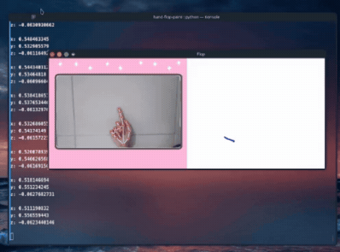

# 🎨 Hand Flop Paint

Aplicativo de desenho desenvolvido em **Python**, utilizando **MediaPipe** e **OpenCV** para detecção de movimentos da mão, além de **Kivy** para a interface gráfica.

## Demonstração

<p align="center">
  
</p>

---

## Requisitos

- Python 3.11
- Ambiente virtual (venv)

---

## Configuração do Ambiente

### 1. Clone o repositório

```bash
git clone https://github.com/lavicardosoo/flop-paint.git

cd flop-paint/deteccao-de-movimento
```

### 2. Crie um ambiente virtual

#### Linux/macOS

```bash
python3.11 -m venv .venv
source .venv/bin/activate
```

#### Windows

```bash
python -m venv .venv
.venv\Scripts\activate
```

### 3. Instale as dependências

```bash
pip install mediapipe==0.10.14
pip install opencv-python
pip install kivy
```

Ou:

```bash
pip install mediapipe==0.10.14 opencv-python kivy
```

---

## Executando o Projeto

```bash
python archangel.py
```

---

## Tecnologias Utilizadas

- Python 3.11
- MediaPipe 0.10.14
- OpenCV
- Kivy

---

## Estrutura Básica

```text
.
├── assets/
│   └── demo.gif
├── archangel.py
├── README.md
└── requirements.txt
```

---

## Observações

- O projeto foi desenvolvido e testado com Python 3.11.
- Versões diferentes do MediaPipe podem causar incompatibilidades.
- Certifique-se de que a câmera esteja funcionando corretamente antes de executar o aplicativo.
